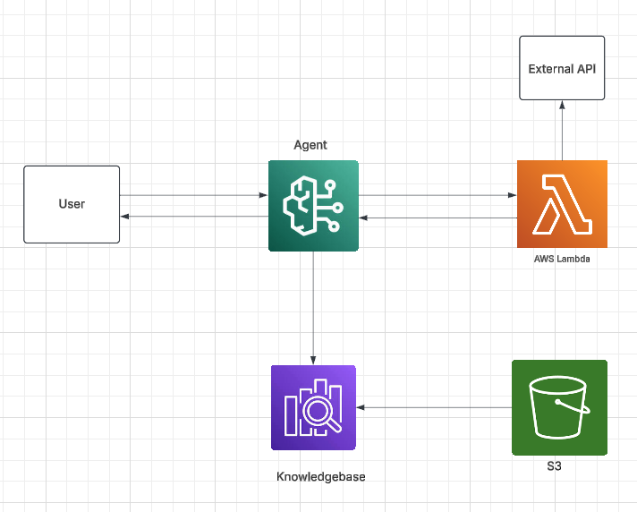

## Pre-requesites(assuming you have brew installed)
1. Install Python(if you don't have one) 
```sh
brew install python
 ``` 
2. Install poetry (poetry is is a dependency management and packaging tool for Python that simplifies project setup, handles virtual environments, and ensures consistent builds with a pyproject.toml configuration file)
```sh
brew install poetry
 ``` 

## Setup poetry

1. Install dependencies(alternatively you can use pip install -r requriements.txt, in case you do not prefer to use poetry): 
```sh
poetry install --no-root
 ```   
2. add plugin "shell" to activate virtual env:
```sh 
poetry self add poetry-plugin-shell
 ```   

3. Create or activate the virtual environment(if already exists) with 
```sh 
poetry shell 
 ```  
## Set up aws account and aws credentials. 
1. Setup aws account and account role and give access to services  with IAM from [policies.txt](policies.txt)
2. Create role for bedrock agent and give these permissions with IAM to get access to bedrock [policies.txt](policies.txt), copy ARN


## Setup your aws credentials
Set up credentials for created aws account to which the account role is given in prev step, point 1, you need to generate access key for this account to be able to use aws cli 
```sh 
aws confgiure 
  ``` 

## Env variables 
Create .env variables and set these:
1. REGION=region, in my case - 'us-east-1'
2. AGENT_NAME=name of your agent
3. S3_BUCKET_NAME=name of your s3 bucket
4. FOUNDATION_MODEL='us.anthropic.claude-3-5-haiku-20241022-v1:0', the model to which you get access under your agent role below
5. AGENT_RESOURCE_ROLE_ARN = agent_role resource name that you have created in previously, step 2

# Execution Stages. 

## Stage 1. Create S3 bucket and upload docs and creates lambda function for agent logic
```sh 
./upload_and_create.sh
 ``` 
## Stage 2. Create knowledgebase from these docs 

Ideally run following command with terraform, but turns out last version, v5.92.0 terraform does not support  data sync from s3 to knowledge base yet. Instead, we can follow sdk with boto3 for that. First, need to create a collection with
```sh 
python src/kb/collection_build.py
 ```
Then, need to create index, then use it for knowlegde base with data sync from s3. Following the  
```sh 
python src/kb/kb_build.py
 ```
Alternatively, you can follow steps in creating kb in aws bedrock console in [here](kb_console.txt)

## Stage 3. Build agent 
Agent_build.py returns knowledebase_id and agent_id and sets them as env variable
```sh 
python src/agent/agent_build.py 
 ```

## Stage 4. Create CLI interaction
This initates the CLI chat with agent that has some limited capabilites for demo.
```sh 
 python src/agent/agent_chat.py
  ```

## Simple System Diagram 


## Business logic 
This agent helps expats to adapt in east Netherlands. It can help with general information looking up at his knowledge base. Also, it has some additional support functions and uses lambda handler to process it's actions. 


